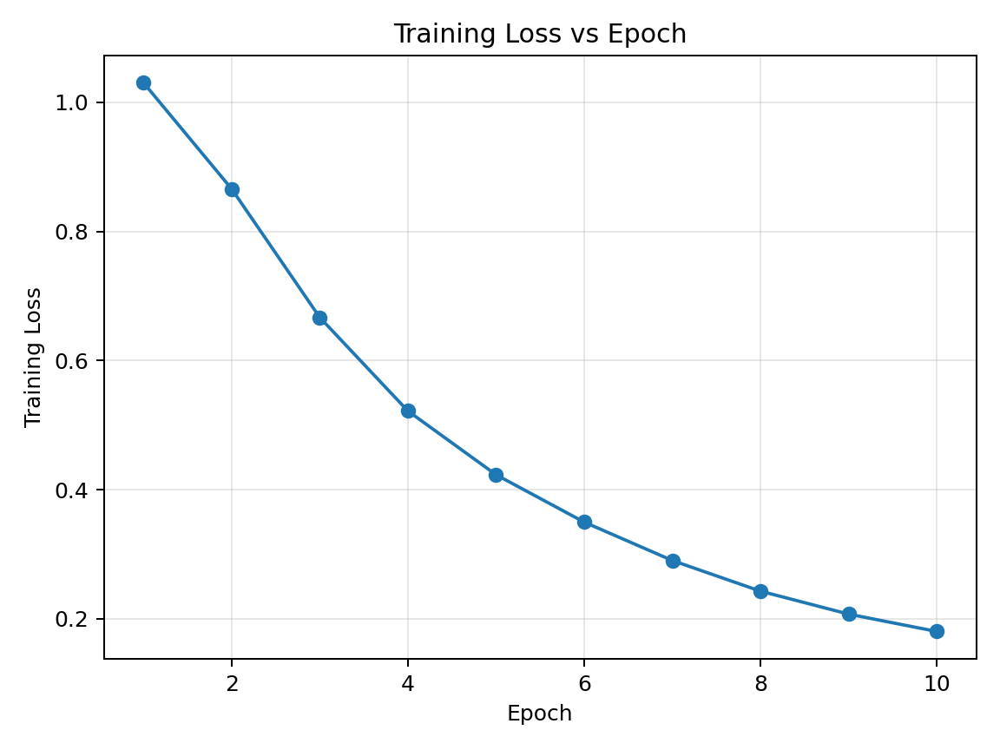
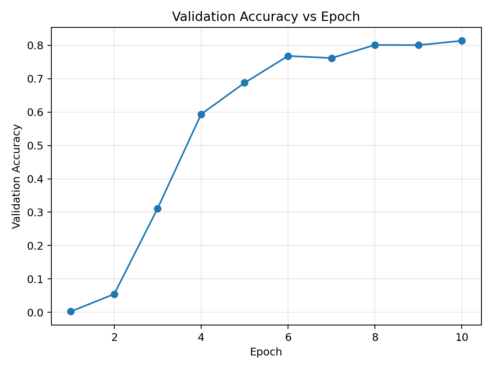

# PHOSCnet — Zero-Shot Word Spotting (PyTorch)

A PyTorch implementation of **PHOSCnet** with **Temporal Pyramid Pooling** for zero-shot
handwritten word recognition. The network predicts two attribute representations of a word
image — **PHOC** (Pyramidal Histogram of Characters, multi-label) and **PHOS** (Pyramidal
Histogram of Shapes, regression) — and recognises words by nearest-neighbour retrieval in
the combined attribute space. Because recognition is done by matching attribute vectors
rather than classifying fixed labels, the model can read **unseen words it was never trained
on** (zero-shot).

Originally built as a graded assignment for **DTE-2502 Neural Networks** (UiT — The Arctic
University of Norway). The starter code provided stubs for `dataset.py`, `loss.py`, and
`models.py`; the implementations here are my own.

## Results

Trained for 10 epochs (AdamW, lr 1e-4) on the IAM-derived split. Evaluation uses cosine
nearest-neighbour retrieval against the word attribute map.

| Test set | Accuracy |
|---|---|
| Seen words | **80.8 %** |
| Unseen words (zero-shot) | **80.3 %** |

The near-identical seen/unseen accuracy is the point of the approach: the attribute-based
retrieval generalises to words outside the training vocabulary.

<p align="center">
  
  
</p>

## Architecture

```
Input image (3 x 50 x 250)
        │
   VGG-style conv trunk  ──►  512 channels
        │
   Temporal Pyramid Pooling, levels [1, 2, 5]  ──►  512 x (1+2+5) = 4096
        │
   ┌────┴────────────────────┐
 PHOS head                 PHOC head
 (165-D, ReLU, MSE)        (604-D, Sigmoid, BCE)
```

**Loss:** weighted multi-task objective — `1.5 · MSE(PHOS) + 4.5 · BCE(PHOC)`.

## Repository structure

```
.
├── main.py                 # entry point: train / test modes
├── plot_logs.py            # plots loss & accuracy from log.csv
├── requirements.txt
├── modules/
│   ├── __init__.py
│   ├── models.py           # PHOSCnet (conv trunk + TPP + two heads)
│   ├── pyramidpooling.py   # Spatial/Temporal Pyramid Pooling (3rd-party, see Credits)
│   ├── dataset.py          # phosc_dataset: CSV -> image, PHOS, PHOC
│   ├── loss.py             # PHOSCLoss (weighted MSE + BCE)
│   └── engine.py           # train_one_epoch, accuracy_test
├── utils/
│   ├── __init__.py
│   ├── phos_generator.py   # PHOS vector generator (3rd-party, see Credits)
│   ├── phoc_generator.py   # PHOC vector generator (3rd-party, see Credits)
│   ├── map.py              # word -> PHOSC attribute map
│   └── Alphabet.csv        # shape counts per character (required by PHOS)
├── data/                   # CSV splits only — IMAGES ARE NOT INCLUDED (see Data)
│   ├── train.csv
│   ├── valid.csv
│   ├── test_seen.csv
│   ├── test_unseen.csv
│   ├── test_seen_small.csv
│   └── test_unseen_small.csv
└── assets/
    ├── training_loss.png
    └── val_accuracy.png
```

> Note: `utils/Alphabet.csv` is loaded by a hard-coded relative path (`utils/Alphabet.csv`),
> so run `main.py` from the repository root.

## Installation

```bash
python -m venv .venv
source .venv/bin/activate        # Windows: .venv\Scripts\activate
pip install -r requirements.txt
```

## Data

The CSV splits map image filenames to word labels (columns: `Image, Word, Writer`). The
images themselves come from the **IAM Handwriting Database** and are **not redistributed
here** due to its license. Obtain IAM access from the official source and place the images in
folders matching the CSVs, e.g.:

```
data/
├── train/         # images referenced by train.csv
├── valid/
├── test_seen/
└── test_unseen/
```

## Usage

**Train**

```bash
python main.py --mode train --model PHOSCnet_temporalpooling \
  --train_csv data/train.csv --train_folder data/train \
  --valid_csv data/valid.csv --valid_folder data/valid \
  --batch_size 8 --num_workers 0 --epochs 10 --lr 1e-4
```

**Test** (with a trained checkpoint)

```bash
python main.py --mode test --model PHOSCnet_temporalpooling \
  --pretrained_weights PHOSCnet_temporalpooling/best.pt \
  --test_csv_seen data/test_seen.csv --test_folder_seen data/test_seen \
  --test_csv_unseen data/test_unseen.csv --test_folder_unseen data/test_unseen \
  --batch_size 64 --num_workers 0
```

Training writes checkpoints and `log.csv` into a folder named after `--model`. Plot the
curves with `python plot_logs.py`.

## Pretrained weights

The trained checkpoint (~298 MB) is too large for the Git repository. Download it from the
[Releases page](../../releases) and place it at `PHOSCnet_temporalpooling/best.pt`.

## Credits

- **PHOS / PHOC generators and attribute mapping** (`utils/`): adapted from
  [anuj-rai-23/PHOSC-Zero-Shot-Word-Recognition](https://github.com/anuj-rai-23/PHOSC-Zero-Shot-Word-Recognition).
- **Pyramid pooling** (`modules/pyramidpooling.py`): from
  [revidee/pytorch-pyramid-pooling](https://github.com/revidee/pytorch-pyramid-pooling).
- Attribute representations follow the SPP-PHOCNet line of work on word spotting.
- Course scaffolding: DTE-2502, UiT — The Arctic University of Norway.

## License

Released under the MIT License for the original code in this repository (see `LICENSE`).
Third-party components in `utils/` and `modules/pyramidpooling.py` remain under their
respective upstream licenses; the IAM dataset is subject to its own terms.
